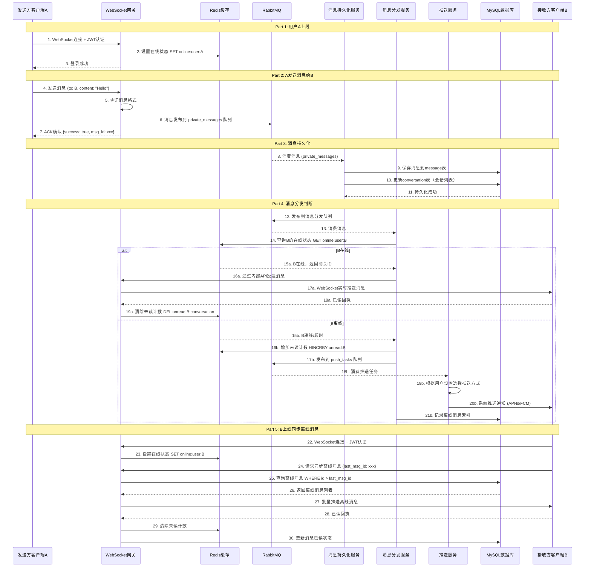

# NetherLink-server 新架构设计方案

## 📋 目录
1. [现状分析](#现状分析)
2. [新架构设计](#新架构设计)
3. [技术选型](#技术选型)
4. [详细流程](#详细流程)
5. [数据库设计](#数据库设计)
6. [实现细节](#实现细节)

## 🔍 现状分析

### 当前问题
1. ❌ **没有离线消息推送机制**：用户离线时无法收到消息通知
2. ❌ **消息未持久化**：WebSocket消息只在内存中传递，未保存到数据库
3. ❌ **缺少在线状态管理**：无法准确判断用户是否在线
4. ❌ **单点故障风险**：WebSocket连接全部存储在单个服务器内存中

### 现有优势
1. ✅ JWT认证机制完善
2. ✅ WebSocket通信稳定
3. ✅ 数据库连接池管理良好
4. ✅ 代码结构清晰，模块化设计

## 🏗️ 新架构设计

### 核心组件
```
┌─────────────────────────────────────────────────────────────────┐
│                         客户端层                                  │
│  (iOS/Android/Web Client) - WebSocket连接                       │
└─────────────────────────────────────────────────────────────────┘
                              ↓↑
┌─────────────────────────────────────────────────────────────────┐
│                      WebSocket网关层                              │
│  • 连接管理                                                       │
│  • 消息接收/分发                                                  │
│  • JWT认证                                                        │
│  • 在线状态同步到Redis                                            │
└─────────────────────────────────────────────────────────────────┘
                              ↓↑
┌──────────────────────┬──────────────────────┬──────────────────┐
│                      │                      │                  │
│   Redis (在线状态)    │   RabbitMQ (消息队列)  │   MySQL (持久化)  │
│                      │                      │                  │
│  • 用户在线状态       │  • private_messages  │  • message表      │
│  • 连接网关映射       │  • offline_messages  │  • user表         │
│  • 未读消息计数       │  • push_tasks        │  • conversation表 │
│                      │                      │                  │
└──────────────────────┴──────────────────────┴──────────────────┘
                              ↓↑
┌─────────────────────────────────────────────────────────────────┐
│                       消息处理服务层                              │
│                                                                  │
│  ┌────────────────┐  ┌────────────────┐  ┌─────────────────┐  │
│  │ 消息持久化服务   │  │ 消息分发服务    │  │ 离线推送服务     │  │
│  │ (Persistence)   │  │ (Dispatcher)   │  │ (Push Service)  │  │
│  │                │  │                │  │                 │  │
│  │ • 保存到数据库   │  │ • 查询在线状态  │  │ • APNs推送      │  │
│  │ • 更新会话列表   │  │ • 实时消息投递  │  │ • FCM推送       │  │
│  │                │  │ • 离线消息入队  │  │ • 邮件通知      │  │
│  └────────────────┘  └────────────────┘  └─────────────────┘  │
│                                                                  │
└─────────────────────────────────────────────────────────────────┘
```

## 🎯 技术选型

### RabbitMQ
- **用途**：异步消息队列，解耦消息发送和处理
- **队列设计**：
  - `private_messages`：私聊消息队列
  - `group_messages`：群聊消息队列
  - `offline_messages`：离线消息同步队列
  - `push_tasks`：推送任务队列

### Redis
- **用途**：在线状态管理、缓存
- **数据结构**：
  - `online:user:{uid}` → `{gateway_id, last_seen}`
  - `unread:{uid}` → Hash存储各会话未读数
  - `connection:{uid}` → WebSocket连接标识

### MySQL
- **用途**：消息持久化、用户数据
- **新增表**：
  - `message`：消息记录表
  - `conversation`：会话列表表
  - `offline_message`：离线消息索引表

## 📊 详细流程

### 流程图：一对一聊天消息完整流程



### 流程说明

#### 1️⃣ 消息发送流程
```
用户A发送消息 → WebSocket网关接收 → 消息入队(RabbitMQ) 
→ 立即返回ACK给用户A → 异步处理后续流程
```

**优势**：
- 快速响应，不阻塞用户操作
- 解耦发送和处理逻辑
- 支持高并发

#### 2️⃣ 消息持久化流程
```
消息持久化服务监听队列 → 接收消息 → 保存到MySQL 
→ 更新会话列表 → 发送到分发队列
```

**关键点**：
- 事务保证数据一致性
- 消息ID使用雪花算法生成
- 会话列表实时更新最后一条消息

#### 3️⃣ 在线用户分发流程
```
分发服务查询Redis在线状态 → 用户在线 
→ 通过WebSocket网关实时推送 → 用户收到消息
```

**实现细节**：
- Redis存储：`online:user:{uid}` → `{gateway_id, timestamp}`
- 支持多网关部署
- 心跳检测保持连接

#### 4️⃣ 离线消息推送流程
```
用户离线 → 消息入离线队列 → 推送服务消费 
→ 根据平台选择推送渠道 → 发送系统通知
```

**推送策略**：
- iOS：APNs推送
- Android：FCM推送
- Web：邮件通知（可选）
- 支持用户自定义推送设置

#### 5️⃣ 离线消息同步流程
```
用户上线 → 客户端请求同步(携带last_msg_id) 
→ 服务器查询数据库 → 批量返回离线消息
```

**优化点**：
- 分页加载，避免一次性加载过多数据
- 增量同步，只同步新消息
- 压缩传输，减少带宽消耗

## 💾 数据库设计

### 1. message表（消息记录）
```sql
CREATE TABLE message (
    id BIGINT PRIMARY KEY AUTO_INCREMENT COMMENT '消息ID',
    conversation_id VARCHAR(100) NOT NULL COMMENT '会话ID',
    sender_id VARCHAR(50) NOT NULL COMMENT '发送者ID',
    receiver_id VARCHAR(50) NOT NULL COMMENT '接收者ID',
    message_type VARCHAR(20) NOT NULL DEFAULT 'text' COMMENT '消息类型',
    content TEXT NOT NULL COMMENT '消息内容',
    extra JSON COMMENT '扩展信息',
    is_group BOOLEAN DEFAULT FALSE COMMENT '是否群聊',
    timestamp TIMESTAMP DEFAULT CURRENT_TIMESTAMP COMMENT '发送时间',
    status TINYINT DEFAULT 0 COMMENT '消息状态 0-未读 1-已读 2-已撤回',
    INDEX idx_conversation (conversation_id, timestamp),
    INDEX idx_receiver (receiver_id, status),
    INDEX idx_sender (sender_id, timestamp)
) ENGINE=InnoDB DEFAULT CHARSET=utf8mb4 COMMENT='消息记录表';
```

### 2. conversation表（会话列表）
```sql
CREATE TABLE conversation (
    id BIGINT PRIMARY KEY AUTO_INCREMENT,
    conversation_id VARCHAR(100) NOT NULL UNIQUE COMMENT '会话ID',
    user_id VARCHAR(50) NOT NULL COMMENT '用户ID',
    target_id VARCHAR(50) NOT NULL COMMENT '对方ID(用户或群组)',
    is_group BOOLEAN DEFAULT FALSE COMMENT '是否群聊',
    last_message TEXT COMMENT '最后一条消息',
    last_message_time TIMESTAMP COMMENT '最后消息时间',
    unread_count INT DEFAULT 0 COMMENT '未读消息数',
    created_at TIMESTAMP DEFAULT CURRENT_TIMESTAMP,
    updated_at TIMESTAMP DEFAULT CURRENT_TIMESTAMP ON UPDATE CURRENT_TIMESTAMP,
    INDEX idx_user (user_id, updated_at),
    UNIQUE KEY uk_user_conversation (user_id, conversation_id)
) ENGINE=InnoDB DEFAULT CHARSET=utf8mb4 COMMENT='会话列表表';
```

### 3. offline_message_index表（离线消息索引）
```sql
CREATE TABLE offline_message_index (
    id BIGINT PRIMARY KEY AUTO_INCREMENT,
    user_id VARCHAR(50) NOT NULL COMMENT '用户ID',
    message_id BIGINT NOT NULL COMMENT '消息ID',
    conversation_id VARCHAR(100) NOT NULL COMMENT '会话ID',
    created_at TIMESTAMP DEFAULT CURRENT_TIMESTAMP COMMENT '创建时间',
    synced BOOLEAN DEFAULT FALSE COMMENT '是否已同步',
    synced_at TIMESTAMP NULL COMMENT '同步时间',
    INDEX idx_user_synced (user_id, synced, created_at),
    INDEX idx_message (message_id)
) ENGINE=InnoDB DEFAULT CHARSET=utf8mb4 COMMENT='离线消息索引表';
```

### 4. push_log表（推送日志）
```sql
CREATE TABLE push_log (
    id BIGINT PRIMARY KEY AUTO_INCREMENT,
    user_id VARCHAR(50) NOT NULL COMMENT '用户ID',
    message_id BIGINT NOT NULL COMMENT '消息ID',
    push_type VARCHAR(20) NOT NULL COMMENT '推送类型 apns/fcm/email',
    push_status VARCHAR(20) NOT NULL COMMENT '推送状态 pending/success/failed',
    push_time TIMESTAMP NULL COMMENT '推送时间',
    error_msg TEXT COMMENT '错误信息',
    created_at TIMESTAMP DEFAULT CURRENT_TIMESTAMP,
    INDEX idx_user_status (user_id, push_status),
    INDEX idx_message (message_id)
) ENGINE=InnoDB DEFAULT CHARSET=utf8mb4 COMMENT='推送日志表';
```

## 🔧 实现细节

### Redis数据结构设计

#### 1. 在线状态
```
Key: online:user:{uid}
Type: Hash
Fields:
  - gateway_id: WebSocket网关ID
  - connected_at: 连接时间戳
  - last_heartbeat: 最后心跳时间
TTL: 300秒（5分钟）
```

#### 2. 未读消息计数
```
Key: unread:{uid}
Type: Hash
Fields:
  - conversation_id_1: count
  - conversation_id_2: count
```

#### 3. 会话列表缓存
```
Key: conversations:{uid}
Type: List (JSON)
Value: [会话列表数据]
TTL: 3600秒（1小时）
```

### RabbitMQ队列设计

#### 1. private_messages（私聊消息队列）
```
Exchange: chat.direct
Routing Key: private.message
Queue: private_messages_queue
Consumer: 消息持久化服务
```

#### 2. offline_messages（离线消息队列）
```
Exchange: chat.topic
Routing Key: offline.#
Queue: offline_messages_queue
Consumer: 消息分发服务
```

#### 3. push_tasks（推送任务队列）
```
Exchange: notification.direct
Routing Key: push.task
Queue: push_tasks_queue
Consumer: 推送服务
Priority: 1-10（支持优先级）
```

## 📈 性能优化

### 1. 消息批量处理
- RabbitMQ设置Prefetch Count，批量消费消息
- 数据库批量插入，减少IO次数

### 2. 缓存策略
- Redis缓存在线状态，避免频繁查询数据库
- 会话列表缓存，减少数据库压力

### 3. 分布式部署
- 支持多个WebSocket网关
- 消息处理服务水平扩展
- 数据库读写分离

### 4. 监控告警
- 消息队列堆积监控
- 消息处理延迟监控
- 推送成功率监控

## 🔒 安全性考虑

### 1. 消息加密
- 敏感消息端到端加密
- 传输层TLS加密

### 2. 防重放攻击
- 消息携带时间戳和签名
- 服务端验证消息有效期

### 3. 流量控制
- 限制单用户发送频率
- 防止消息轰炸

## 🚀 渐进式实施方案

### Phase 1: 基础功能（第1-2周）
- ✅ 引入RabbitMQ和Redis
- ✅ 实现消息持久化
- ✅ 实现在线状态管理
- ✅ 基本的消息分发逻辑

### Phase 2: 离线推送（第3-4周）
- ✅ 离线消息索引
- ✅ 推送服务集成
- ✅ 离线消息同步

### Phase 3: 优化增强（第5-6周）
- ✅ 性能优化
- ✅ 监控系统
- ✅ 群聊消息支持

## 📝 总结

本架构设计方案具有以下特点：

1. **高可用性**：引入消息队列解耦，避免单点故障
2. **高性能**：Redis缓存+异步处理，支持高并发
3. **可扩展**：模块化设计，易于水平扩展
4. **用户体验**：离线消息推送，消息必达
5. **渐进式实施**：分阶段实施，降低风险

该方案完全基于您当前的项目架构，保持了原有的JWT认证、Gin框架、GORM等技术选型，只是在此基础上引入了RabbitMQ和Redis来解决离线消息问题，做到了**最小化改动，最大化收益**。
