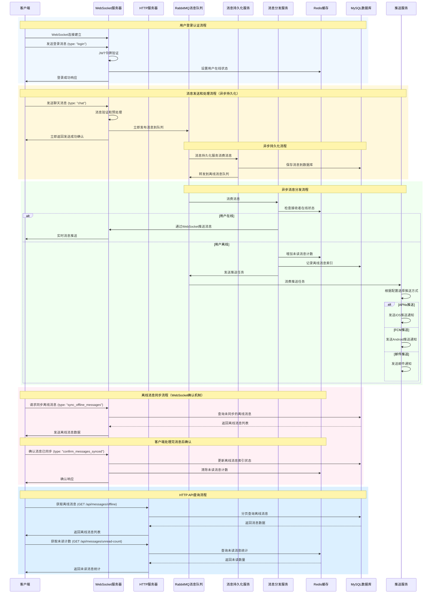
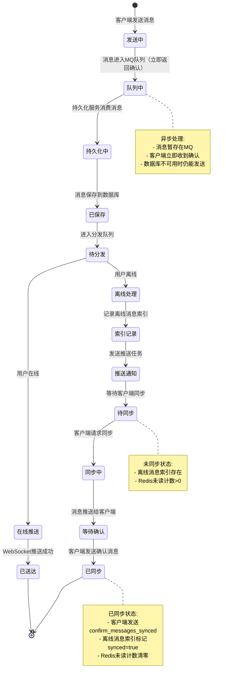

# NetherLink 消息交互流程图

## 完整消息交互流程

## 核心组件职责

### 🖥️ WebSocket服务器
- 处理实时消息收发
- 用户认证和连接管理
- 离线消息同步和确认处理
- 零延迟消息发送体验

### � 消息持久化服务
- 异步消息持久化
- 消息格式验证
- 会话状态更新
- 消息去重处理

### ⚙️ 消息分发服务
- 消息路由决策（在线/离线）
- 离线消息索引记录
- 推送任务触发

### 🌐 HTTP服务器
- RESTful API接口
- 离线消息查询
- 用户信息和动态管理

### 📨 RabbitMQ消息队列
- 异步消息处理
- 解耦消息发送和处理
- 推送任务队列
- 消息暂存缓冲

### � Redis缓存
- 用户在线状态管理
- 未读消息计数缓存
- 会话状态存储

### �🗄️ MySQL数据库
- 消息持久化存储
- 离线消息索引管理
- 用户和会话数据

### 📢 推送服务
- 多渠道推送通知
- APNs (iOS) / FCM (Android) / Email
- 推送配置管理

## 消息状态流转

## 数据流说明

### 消息发送流程
1. **客户端** → **WebSocket** → **消息队列**（立即返回确认）
2. **消息队列** → **持久化服务** → **数据库**（异步保存）
3. **持久化服务** → **消息队列** → **分发服务** → **在线判断**
4. **在线**: WebSocket推送 → **客户端**
5. **离线**: 记录索引 → 推送通知 → **客户端设备**

### 离线消息同步流程
1. **客户端** → **WebSocket** → **数据库查询**
2. **数据库** → **WebSocket** → **客户端**
3. **客户端处理完消息** → **WebSocket确认** → **数据库更新**
4. **数据库** → **Redis更新** → **客户端确认**

## 关键设计特点

### 🔄 异步处理
- 消息发送零延迟响应（立即返回确认）
- 消息持久化异步执行
- 推送通知异步执行
- 极致的用户体验

### 📱 统一WebSocket通道
- 所有实时操作通过WebSocket完成
- 消息同步和确认使用同一连接
- 降低连接开销和复杂性
- 提升通信效率

### 🛡️ 可靠性保证
- 消息队列暂存保证不丢失
- 消息持久化存储
- 离线消息索引跟踪
- 失败重试机制
- 数据库不可用时仍可发送消息

### ⚡ 性能优化
- 消息发送无需等待数据库
- Redis缓存热点数据
- 消息队列削峰填谷
- 分页查询大数据集
- 持久化和分发并行处理</content>
<parameter name="filePath">/home/sqhh99/workspace/cpp-workspace/ch-server/NetherLink-server/MESSAGE_FLOW_DIAGRAM.md